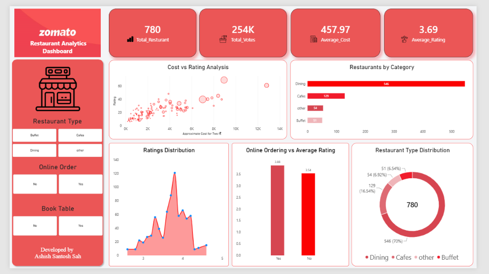
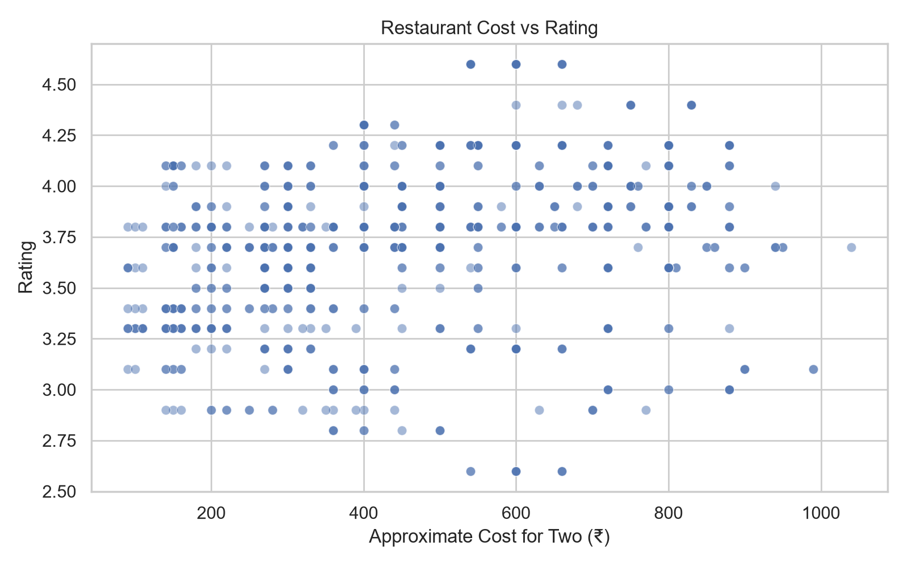
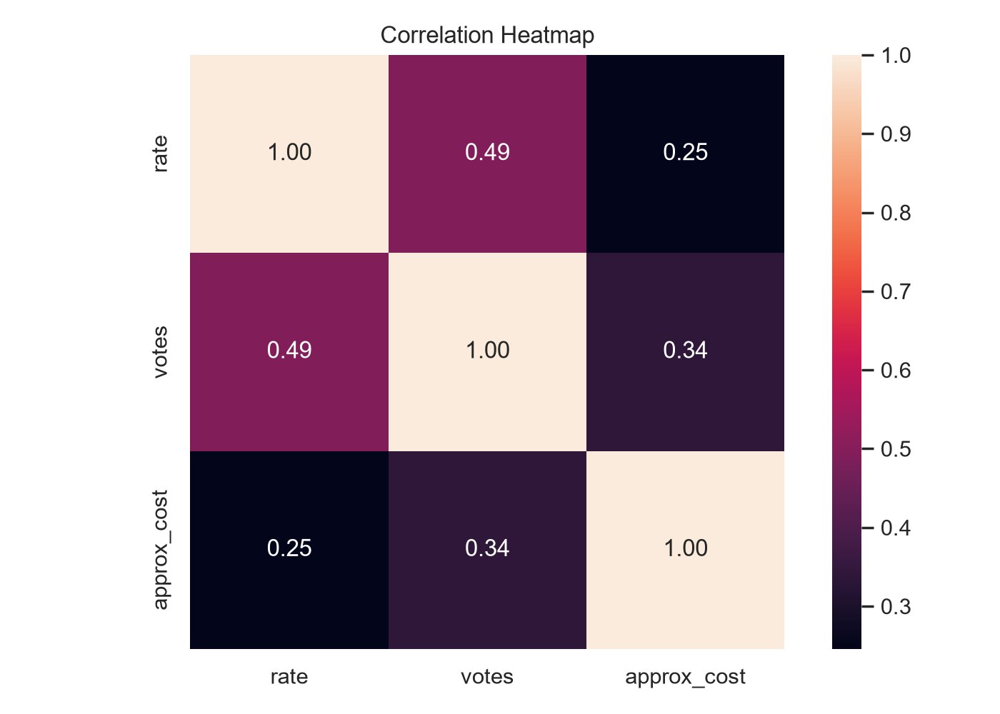
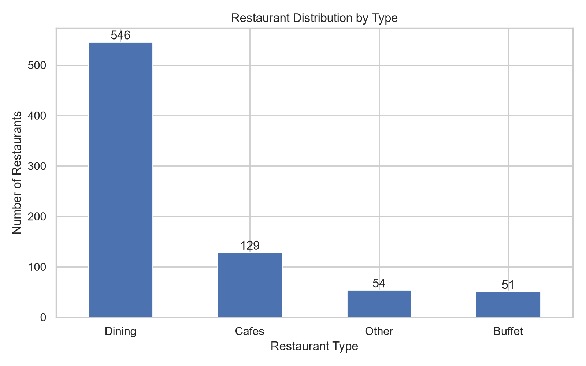
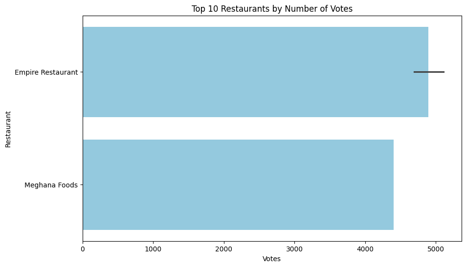

# 🍽️ Zomato Restaurant Data Analytics & Business Intelligence Project


An end-to-end Data Analytics and Business Intelligence project analyzing **780 restaurant records** to uncover critical factors associated with restaurant success, customer engagement, pricing strategies, online ordering, and table booking availability.

---

## 📸 Power BI Dashboard Preview



---

## 📊 Executive Summary & Key Performance Indicators (KPIs)

| Key Performance Indicator | Value | Business Insight |
| :--- | :---: | :--- |
| **Total Restaurants Analyzed** | **780** | Cleaned dataset post-preprocessing |
| **Average Customer Rating** | **3.69 / 5** | Overall industry rating baseline |
| **Total Customer Votes** | **253,772** | High overall market engagement |
| **Average Cost for Two** | **₹458** | Affordable mass-market dining focus |
| **Median Cost for Two** | **₹440** | Representative mid-range cost point |
| **Median Customer Rating** | **3.80 / 5** | Benchmark rating target |

---

## 🔍 Key Analytical Findings

1. **Dining Category Dominance**: Dining restaurants represent **70.0%** of all restaurants in the dataset (546 establishments), followed by Cafes (**16.5%**), Other (**6.9%**), and Buffets (**6.5%**).
2. **Online Ordering Rating Uplift**: Establishments offering online ordering achieve an average rating of **3.88 / 5** compared to **3.54 / 5** for non-online ordering restaurants (a **+0.34 point rating advantage**).
3. **Table Reservation Advantage**: Establishments featuring table reservation functionality show an average rating of **4.16 / 5** vs **3.65 / 5** for non-booking restaurants (a **+0.51 point rating advantage**).
4. **Customer Engagement vs. Pricing Correlation**: Customer votes demonstrate a **0.49 correlation** with ratings, proving significantly stronger than pricing correlation (**0.25**), indicating customer engagement is a key driver of restaurant reputation.

---

## 📈 Visual Exploratory Data Analysis (EDA)

| Cost vs. Rating Scatter Plot | Correlation Heatmap |
| :---: | :---: |
|  |  |

| Restaurant Distribution by Type | Customer Votes vs. Rating |
| :---: | :---: |
|  |  |

---

## 🗂️ Project Repository Structure

```
Zomato/
├── README.md                             # Comprehensive GitHub documentation
├── .gitignore                            # Standard Git ignore configuration
├── data/
│   ├── clean/
│   │   └── Zomato_cleaned.csv            # Processed dataset (780 records, 7 columns)
│   └── raw/
│       └── Zomato.csv                    # Raw original dataset (1,000 records)
├── notebooks/
│   ├── data_cleaning.ipynb               # Data preprocessing & standardization
│   ├── data_validations.ipynb            # Data integrity validation checks
│   └── EDA.ipynb                         # Exploratory Data Analysis & visualization
├── powerbi/
│   ├── zomato.pbix                       # Interactive Power BI dashboard file
│   └── zomato_dashboard_screenshot.png   # Dashboard visual preview
├── reports/
│   ├── Zomato_Analysis_Report.pdf        # Automated compiled PDF report
│   ├── Zomato_Analysis_Report.md         # Formatted Markdown report
│   └── generate_report.py                # Automated Python report generator script
├── sql/
│   ├── business_queries.sql              # 16+ analytical SQL business queries
│   └── zomato_database.sql               # Database DDL schema setup
└── visualization/                        # Exported high-resolution chart images
    ├── average_rating.png
    ├── Correlation_Heatmap.png
    ├── Cost_Distribution.png
    ├── Cost_vs_Rating.png
    ├── Online_ordering_Distribution.png
    ├── Ordering_vs_Rating.png
    ├── restaurant_Distribution.png
    ├── restaurant_type_count.png
    ├── Restaurants_by_Votes.png
    ├── Table_Booking_Distribution.png
    └── TableBooking_vs_Rating.png
```

---

## 💻 SQL Business Queries Preview

The `sql/business_queries.sql` script contains 16+ analytical queries for relational database engines:

```sql
-- Query: Top-rated budget restaurants with strong customer engagement (Rating >= 4.0, Cost <= ₹500)
SELECT 
    name,
    rate,
    votes,
    approx_cost
FROM zomato_restaurants
WHERE rate >= 4.0
  AND approx_cost <= 500
ORDER BY rate DESC, votes DESC;
```

---

## ⚙️ How to Run the Project Locally

### 1. Clone the Repository
```bash
git clone https://github.com/AshishSah7464/Zomato-Data-Analytics-Project.git
cd Zomato-Data-Analytics-Project
```

### 2. Install Dependencies
```bash
pip install pandas numpy matplotlib seaborn reportlab
```

### 3. Run Notebooks & Report Generation
* Execute Jupyter Notebooks inside `notebooks/` directory.
* Run the automated PDF generator:
```bash
python reports/generate_report.py
```

---

## 💡 Strategic Business Recommendations

1. **Onboard Digital Ordering Channels**: Restaurants lacking online ordering should implement delivery integration to capitalize on the **+0.34 point rating advantage**.
2. **Enable Table Booking Options**: Dine-in establishments targeting premium customer segments can enhance customer convenience and achieve higher overall satisfaction (**+0.51 rating uplift**).
3. **Prioritize Customer Engagement**: Actively encourage customer reviews, votes, and feedback, as engagement correlates much more strongly with higher ratings (**0.49**) than price point (**0.25**).
4. **Differentiate in the Dining Segment**: Because Dining represents **70%** of the market share, targeted operational improvements in dining service offer the largest growth potential.

---

## 📜 License & Credits

* **Author**: [Ashish Sah](https://github.com/AshishSah7464)
* **Dataset**: Zomato Restaurant Data
* **License**: MIT License
